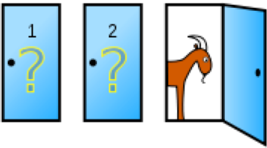

# 쉬어가기: 몬티홀 문제

그럼 이제까지 이야기한 내용을 바탕으로 재미있는 문제를 풀어보도록 하겠습니다. '몬티홀 문제'로 유명한 문제 입니다.

퀴즈쇼에서 위의 그림에서와 같이 3개의 문이 주어졌을 때, 시청자는 3개의 문 중에서 상품이 뒤에 있는 문을 골라야 합니다. 진행자는 정담이 있는 문을 알고 있으며, 시청자가 1개의 문을 처음에 골랐을 때, 시청자가 고르지 않은 문 1개를 더 열어주며 그 뒤에 정답이 없음을 보여 줍니다. (즉, 꽝인 문을 열어 보여 줍니다.) 이때 진행자가 시청자에게 기존의 선택을 바꿀 기회를 준다면, 시청자는 어떻게 해야 할까요?

우리는 이 문제를 3개의 사건(랜덤 변수)를 갖는 확률 문제로 생각 할 수 있습니다. 우리에게 3개의 문(인덱스: 0, 1, 2)들이 주어졌을 때, 시청자가 처음에 고른 문에 대한 사건을 $A$, 진행자가 시청자에게 열어주는 문에 대한 사건을 $B$, 그리고 정답이 있는 문에 대한 사건을 $C$라고 하겠습니다. 즉, 우리가 궁금한 내용은 아래와 같이 단순화 할 수 있습니다.

$$
P(C=2|A=0,B=1)>P(C=0|A=0,B=1)
$$

만약 위의 식이 맞다면 시청자는 정답을 바꿔야 할 것이며, 틀리다면 시청자는 진행자의 권유에도 아랑곳하지 않고 원래의 선택을 고수해야 할 것 입니다. 그럼 우리는 위 식의 좌변과 우변에 대해서, 앞서 배운 내용(조건부 확률과 독립 시행)을 바탕으로 문제를 풀어 보도록 하겠습니다.

$$
\begin{aligned}
P(C=2|A=0,B=1)&=\frac{P(A=0,B=1,C=2)}{P(A=0,B=1)} \\
&=\frac{P(B=1|A=0,C=2)P(A=0,C=2)}{P(A=0,B=1)} \\
&=\frac{P(B=1|A=0,C=2)P(A=0)P(C=2)}{P(B=1|A=0)P(A=0)} \\
&=\frac{1 \times \frac{1}{3}}{\frac{1}{2}}=\frac{2}{3},\\
\text{where }P(B=1|A=0)=&\frac{1}{2},~P(C=2)=\frac{1}{3},\text{ and }P(B=1|A=0,C=2)=1.
\end{aligned}
$$

위의 식에서 시청자가 처음에 문을 선택하는 것과, 정답이 있는 문은 독립 관계이므로, $P(A=0,C=2)=P(A=0)P(C=2)$가 됩니다. 만약 시청자가 첫번째 문($A=0$)을 선택하였고, 정답 문이 세 번째 문이었다면($C=2$), 진행자는 시청자에게 열어줄 수 있는 문은 단 한개 입니다 <comment> $B=1$. 따라서 우리는 $P(B=1|A=0,C=2)=1$임을 알 수 있습니다. </comment>

$$
\begin{aligned}
P(C=0|A=0,B=1)&=\frac{P(A=0,B=1,C=0)}{P(A=0,B=1)} \\
&=\frac{P(B=1|A=0,C=0)P(A=0,C=0)}{P(A=0,B=1)} \\
&=\frac{P(B=1|A=0,C=0)P(A=0)P(C=0)}{P(B=1|A=0)P(A=0)} \\
&=\frac{\frac{1}{2} \times \frac{1}{3}}{\frac{1}{2}}=\frac{1}{3},\\
\text{where }&P(B=1|A=0,C=0)=\frac{1}{2}
\end{aligned}
$$

앞서와 마찬가지로 식을 전개하여 보면, $1/3$이 나오는 것을 알 수 있습니다. 따라서 우리는 선택을 바꿔야 함을 알 수 있습니다.